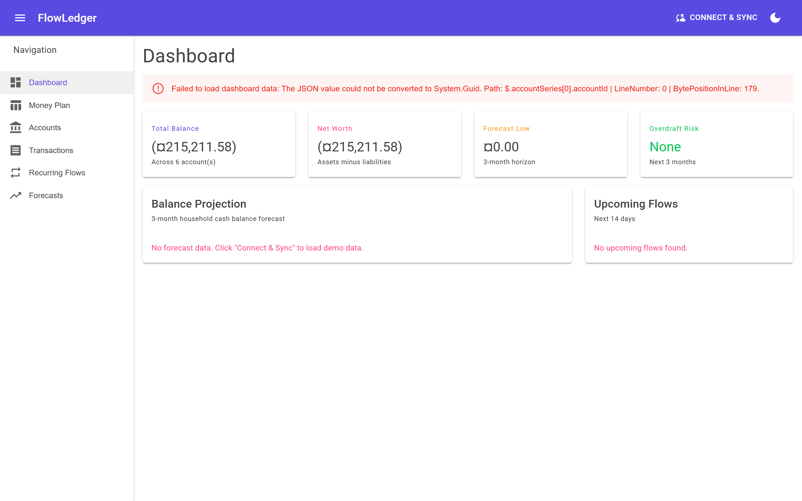
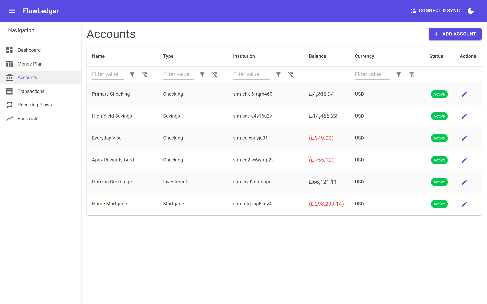
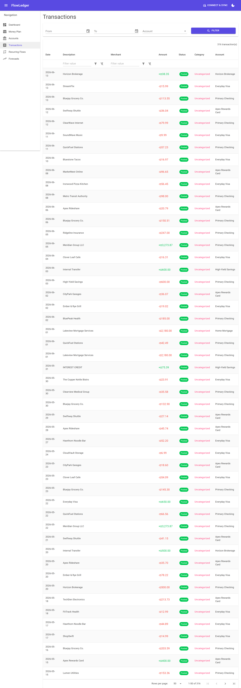
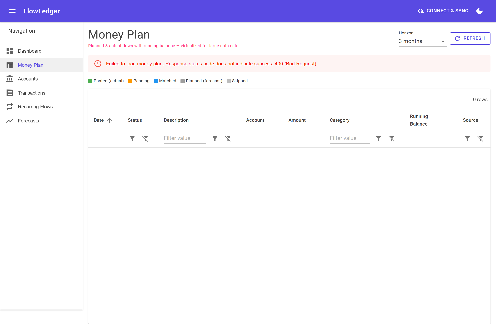
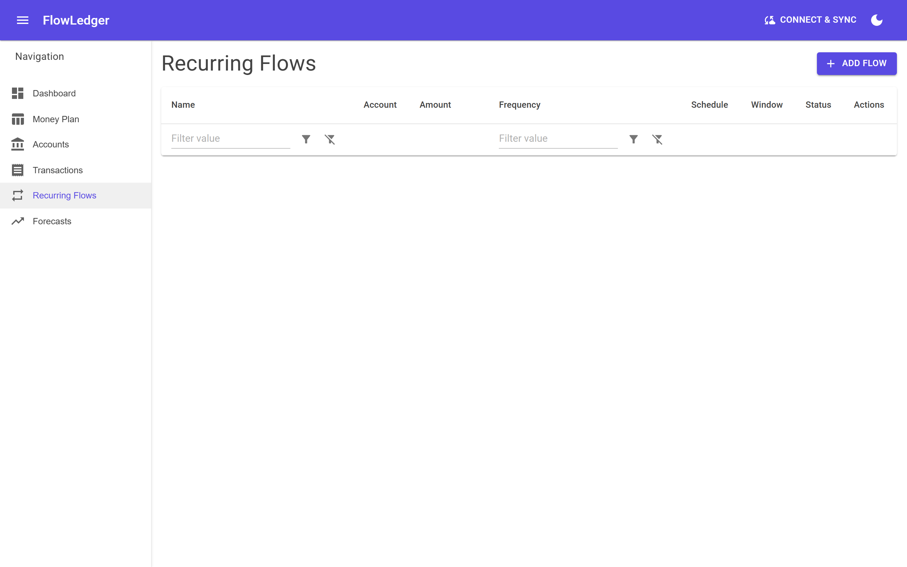
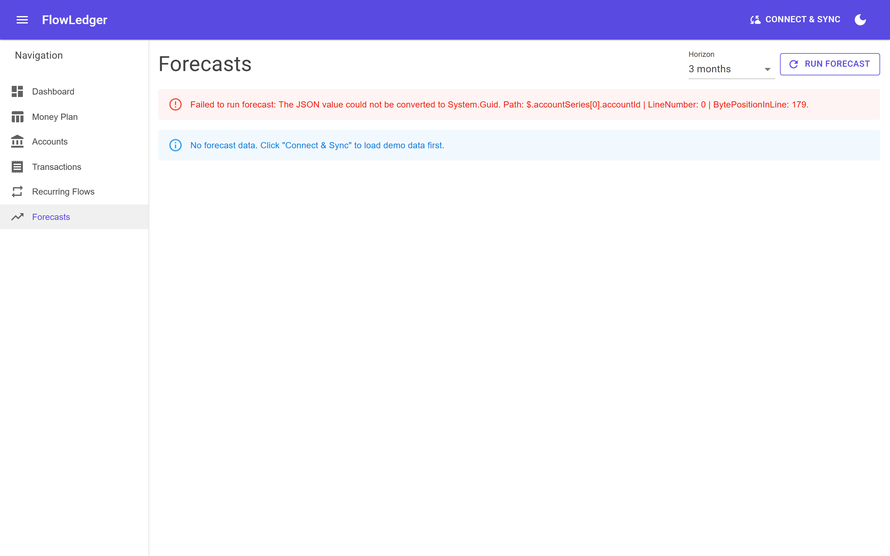

# FlowLedger User Guide

> All screenshots below use 100% synthetic demo data — no real financial information,
> no real account numbers, no real people. Merchant and institution names are clearly
> fictional (e.g. "Bluejay Grocery Co.", "Lumen Utilities", "Meridian Group LLC").

---

## Table of Contents

1. [Dashboard](#dashboard)
2. [Accounts](#accounts)
3. [Transactions](#transactions)
4. [Money Plan](#money-plan)
5. [Recurring Flows](#recurring-flows)
6. [Forecasts](#forecasts)

---

## Dashboard

The Dashboard is your home screen. It shows a high-level summary of your financial
position and a forward-looking Balance Projection chart.

*The Dashboard summary cards show Total Balance, Net Worth, Forecast Low, and Overdraft Risk.
The Balance Projection chart plots the running balance 30–90 days forward, highlighting
low-water marks where the balance dips below a safe threshold.*

### What you will see

- **Total Balance** — the sum of all non-mortgage, non-investment asset accounts.
- **Net Worth** — total assets minus total liabilities.
- **Forecast Low** — the minimum projected checking balance in the forecast window.
- **Overdraft Risk** — a flag that turns red when the forecast low dips below zero.
- **Balance Projection chart** — a time-series line chart of your projected checking
  balance driven by Recurring Flows. The chart is deterministic: it will always produce
  the same curve for the same set of recurring flows.
- **Upcoming Flows** — the next few scheduled inflows and outflows from your Recurring
  Flows configuration (e.g. payroll, mortgage, subscriptions).

### Low-water-mark warnings

When the forecast detects that your balance will fall below a configurable threshold
(default: $0), the **Overdraft Risk** card turns red and the chart marks the dip point.
This is the primary signal FlowLedger uses to alert you before a problem occurs.

---

## Accounts

The Accounts page lists every connected financial account with its current balance,
account type, and currency.

*The demo household has six accounts: Primary Checking, High-Yield Savings,
Everyday Visa (credit), Apex Rewards Card (credit), Horizon Brokerage (investment),
and Home Mortgage. Each row shows the current balance and account type.*

### Account types

| Type | Description |
|------|-------------|
| CHECKING | Primary transaction account. Inflows (payroll) and outflows (mortgage, utilities) flow through here. |
| SAVINGS | High-yield savings. Receives monthly transfers and interest credits. |
| CREDIT | Revolving credit cards. Balances are negative (owed). |
| INVESTMENT | Brokerage / investment account. Receives monthly contributions and dividend reinvestments. |
| MORTGAGE | Home loan. Balance is negative (outstanding principal). |

### Connecting accounts

FlowLedger supports two data sources:

- **Simulated** (default) — deterministic demo data, no credentials needed.
- **MX** — real bank aggregation via MX.com. Enable with `Mx:Enabled=true` and supply
  your API credentials (see [Getting Started](getting-started.md)).

---

## Transactions

The Transactions page shows the full history of imported transactions across all accounts,
with filtering and search capabilities.

*The transaction grid shows date, description, merchant, category, account, and amount.
The demo data spans multiple months and includes diverse categories: payroll, housing,
utilities, groceries, dining, transport, subscriptions, insurance, healthcare,
investments, and savings transfers.*

### Filtering

Use the **Apply Filters** toolbar to filter by:

- Date range
- Account
- Category
- Amount range
- Description text search

Transactions are imported via the `/api/sync` endpoint or, for MX users, via webhook
events that trigger an incremental sync automatically.

### Transaction categories

The demo data includes these synthetic categories:

| Category | Example merchant |
|----------|-----------------|
| Payroll | Meridian Group LLC |
| Housing | Lakeview Mortgage Services |
| Utilities | Lumen Utilities, ClearWave Internet |
| Groceries | Bluejay Grocery Co. |
| Dining | The Copper Kettle Bistro, Mapletree Sushi |
| Transport | Metro Transit Authority, QuickFuel Stations |
| Subscriptions | StreamFlix, SoundWave Music, ShopSwift |
| Insurance | Ridgeline Insurance |
| Healthcare | Clearview Medical Group, BluePeak Health |
| Investments | Horizon Brokerage |
| Savings | High-Yield Savings |
| Interest | (credited by savings account) |

---

## Money Plan

The Money Plan is a spreadsheet-like view of your planned cash flows. Each row represents
a planned inflow or outflow, and the rightmost column shows the running balance after
each row is applied.

*The Money Plan shows planned flows in chronological order with a running balance column.
Rows where the balance turns red indicate a projected shortfall. Green rows are on track.*

### How it works

1. Add planned income and expense rows (or generate them from Recurring Flows).
2. FlowLedger calculates the running balance starting from today's checking balance.
3. Any row that would bring the balance below zero is flagged.
4. Use this view to answer: *"Can I afford that vacation in August?"*

### Row statuses

| Status | Meaning |
|--------|---------|
| Planned | Future event, not yet occurred |
| Completed | Event occurred and matches an imported transaction |
| Overdue | Past due date with no matching transaction |
| Skipped | Manually marked as not applicable |

---

## Recurring Flows

Recurring Flows are the repeating financial events that drive both the Money Plan and
the Forecast. They represent predictable inflows (payroll, interest) and outflows
(mortgage, subscriptions, utilities).

*Each row in Recurring Flows shows the flow name, amount, frequency, next occurrence,
and account. Inflows are shown in green; outflows in red.*

### Flow frequencies

- **Weekly** — e.g. grocery budget
- **Bi-weekly** — e.g. payroll (every two Fridays)
- **Monthly** — e.g. mortgage, utilities, subscriptions
- **Quarterly** — e.g. dividend reinvestment
- **Annual** — e.g. insurance renewal, tax payment

### Editing flows

Click any row to open the edit dialog. You can change the amount, frequency, start/end
date, and which account the flow is associated with.

---

## Forecasts

The Forecasts page is a dedicated view of the balance projection chart with additional
controls for adjusting the forecast horizon and toggling which accounts are included.

*The Forecasts chart plots the projected account balance over the selected time horizon.
The demo data is designed to produce a visible low-water mark — a dip that triggers the
overdraft warning on the Dashboard — so you can see the forecasting features in action.*

### Forecast parameters

- **Horizon** — how many days forward to project (default: 90 days).
- **Starting balance** — the current balance of the selected account.
- **Recurring Flows** — all active flows in the configured date range are included.

### Interpreting the chart

- The line represents the projected running balance.
- A red band or marker indicates days where the balance is projected to be negative.
- The goal of the forecast is to give you enough lead time to take action before a
  shortfall occurs — by adjusting spending, accelerating income, or drawing from savings.

---

## Demo data note

The screenshots in this guide use the built-in **Simulated** data provider, which
generates a deterministic demo household with clearly fictional data:

- Institutions: "Lakeview Mortgage Services", "Ridgeline Insurance", "ClearWave Internet"
- Merchants: "Bluejay Grocery Co.", "Metro Transit Authority", "The Copper Kettle Bistro"
- Employer: "Meridian Group LLC"

No real account numbers, real names, real emails, real SSNs, or real financial data
appear anywhere in the demo data or in these screenshots.

To use FlowLedger with real data, enable the MX integration
(see [Getting Started](getting-started.md#mx-integration)).
